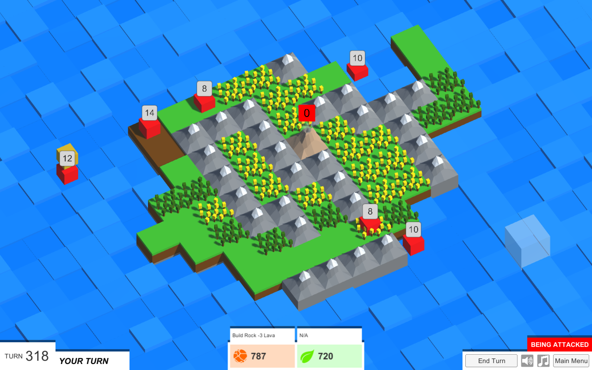

# Island Defence

*You play as a sentient volcano expanding your island into the vast ocean, while defending against greedy pirates that hunger for the treasure buried deep below you.*

This is the (mostly) unaltered source code for the game I made with C# and Unity for the 34th Ludum Dare (late 2015), themes "Two Buttons" and "Growing."

- Game page on [itch.io](https://epicruins195.itch.io/island-defence)
- Entry page on [Ludum Dare](http://ludumdare.com/compo/ludum-dare-34/?action=preview&uid=60072)

## Development

This project was one of my first major explorations in game development with Unity, and with using C# in general. The main aspects that I gained experience in were:
- Passing information between many different "manager" type scripts.
- Structuring a complete game project with the connections between game logic, graphics and UI (sound is notably missing).
- Pathfinding using the A* algorithm.
- Designing a responsive UI.
- Having an idea, iterating and prototyping it, and then developing it into a complete software application.

## Future direction

I plan on rewriting the game with a much more well-developed plan in mind sometime in the future.
